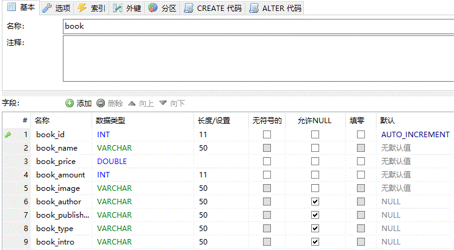

<html>
	<head>
		<meta charset="utf-8">
	</head>
	<body>
		<h1>BOOK STORE demo</h1>
		<h2>版本：v1.0</h2>
		<h2>特点：用纯servlet+jsp编写的一个小型书店网站;基本使用table方式进行页面的布局</h2>
		<h2>缺点：</h2>
		<h3>1、购物车页面全选等显示待补全;</h3>
		<h3>2、搜索、分类、购买等功能未实现;</h3>
		<h2>实现的功能：</h2>
		<h3>1、注册、登录、退出（包括进行简单的注册验证、登陆验证）;</h3>
		<h3>2、购物车（包括添加进购物车和显示用户购物车商品页面）;</h3>
		<h2>使用的数据库表: customers、book、orderitems,如下：</h2>
		<h3 align="center">customers</h3>
		

		<h3 align="center">book</h3>
		

		<h3 align="center">orderitems</h3>
		

	
	</body>
</html>